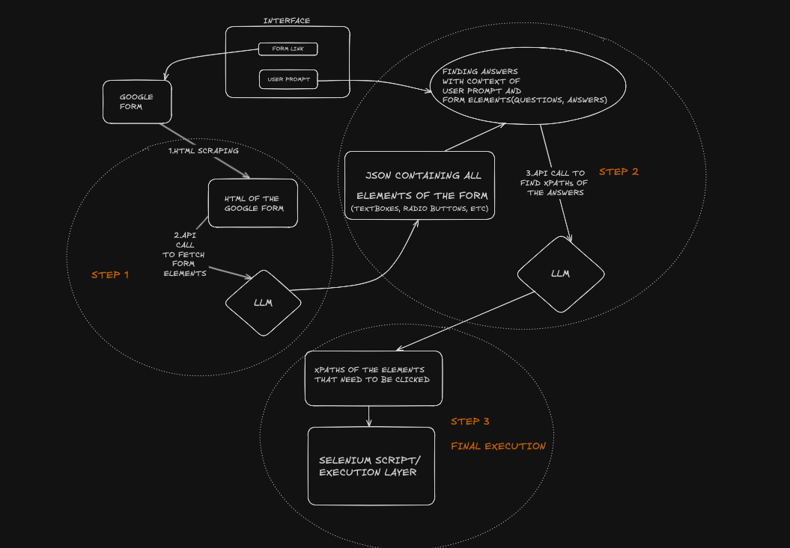

# Web Agent

Web Agent is an AI-powered tool designed to navigate websites and fill out forms dynamically using reasoning capabilities. It combines a React frontend with a FastAPI backend, utilizing AI models to process and fill out Google Forms automatically.

## Features

- User-friendly interface for inputting form links and requirements
- AI-powered form analysis and filling
- Automated web navigation and form submission
- Event logging and screenshot capture for debugging

## Project Structure

- `interface/`: React frontend
- `backend/`: FastAPI backend
  - `main.py`: FastAPI server
  - `process.py`: Core logic for form processing
  - `get_html.py`: Selenium-based HTML retrieval
  - `utils.py`: Utility functions for web interaction

## Flow Diagram

1. Solution 1
  

2. Solution 2(using LangChain Agents and Tool calling)
  

## Setup Instructions

1. Clone the repository:
   ```
   git clone https://github.com/shaRk-033/web-agent
   cd web-agent
   ```

2. Set up the frontend:
   ```
   cd interface
   npm install
   npm start
   ```

3. Set up the backend:
   ```
   cd backend
   pip install -r requirements.txt
   python main.py
   ```

Make sure to set up the necessary environment variables and API keys for the AI models used in the project.

Check out the documentation of the backend in docs.md :)
